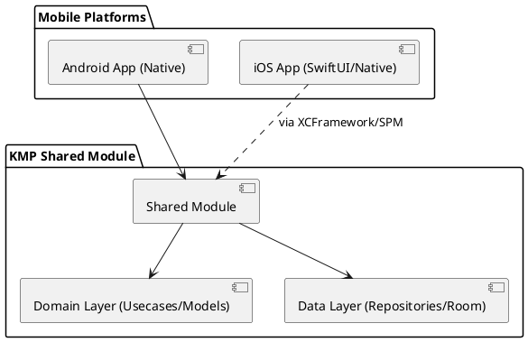
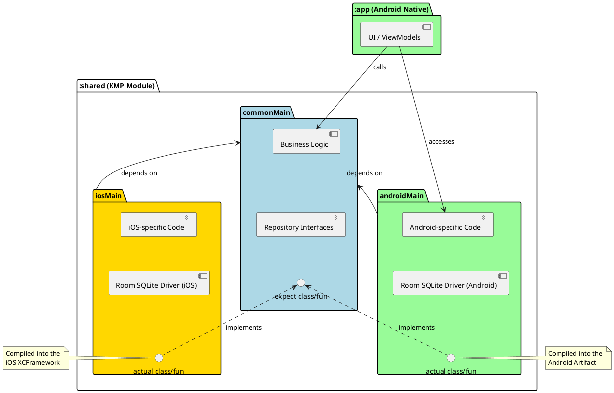
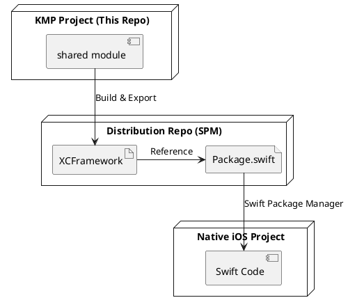
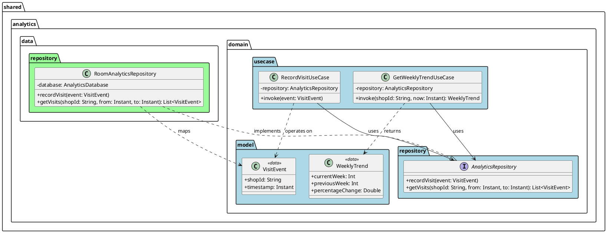

# Native Android to KMP Migration

This project is a fork of the [NativeAppTemplate-Free-Android](https://github.com/nativeapptemplate/NativeAppTemplate-Free-Android), originally a production-ready native Android app.  

The goal of this fork is to demonstrate the migration of a mature native codebase to **Kotlin Multiplatform (KMP)**. By introducing a `:shared` module, we move core business logic and data persistence into a platform-agnostic layer, enabling code reuse across Android and iOS.

## 🏗 Project Architecture

The project has evolved from a monolithic Android app into a multi-module KMP structure:

### The `:shared` Module
This is the heart of the migration. It contains the logic that is identical across platforms, reducing duplication and bugs.

*   **`commonMain`**: Contains the core logic, domain models, and repository interfaces.
*   **`androidMain` & `iosMain`**: Handle platform-specific implementations (like Database drivers or Platform info) using the `expect`/`actual` pattern.

#### Source Set Interaction
The following diagram details how the Android application consumes the shared module and how the different source sets interact through the `expect`/`actual` mechanism:

---

## Migration Strategy & Philosophy

The migration follows a structured approach designed to minimize friction for platform-specific developers, especially on the iOS side.

### 1. The Shared Foundation
We start by creating the `:shared` KMP module within the Android project. The first priority is defining the **Domain** (Models, Use Cases) and **Data** (Repositories) layers here. This ensures that the business "truth" is centralized from the start.

### 2. Dependency Injection: Hilt to Koin
A key technical step was migrating the dependency injection framework from **Hilt** (Android-specific) to **Koin**. 
- **Why?** Koin is a lightweight, Kotlin-first DI framework that works seamlessly across Multiplatform targets, allowing us to share module definitions between Android and iOS.

### 3. iOS Integration: "No-Gradle" Philosophy
The core philosophy is that **iOS developers should not be forced to use Gradle.** Forcing an Android build tool onto an iOS environment often leads to a poor developer experience.

Instead, the `:shared` module is exposed as an **XCFramework**:
- **Local Testing**: Initially integrated as a [direct local framework](https://kotlinlang.org/docs/multiplatform/multiplatform-ios-integration-overview.html#direct-integration) to validate logic.
- **Remote Distribution (SPM)**: For production, the module is distributed as a [Swift Package (SPM)](https://kotlinlang.org/docs/multiplatform/multiplatform-spm-export.html). 

### 4. Dedicated Distribution Repository
To keep the iOS consumption as clean as possible, I created a **separate repository** for the distributed package: https://github.com/ovicristurean/AnalyticsKit 
- **Contents**: The archived `.xcframework`, a `Package.swift` file, and a dedicated README.
- **Benefit**: The iOS app only fetches the necessary binary and metadata, not the entire KMP source project. This mirrors how iOS devs consume any other 3rd party dependency.

---

## New Feature: Shared Analytics System

The primary feature migrated to KMP is a POC for an **Analytics System**. Instead of implementing tracking logic twice, it is now centralized in the `:shared` module.

### Concrete Class Interaction
The following diagram shows the specific classes and interfaces involved in the Analytics feature and how they interact:

### Benefits of this Approach
-   **Single Source of Truth**: Business rules (like the calculation of weekly trends) are written once in `GetWeeklyTrendUseCase`.
-   **Offline First**: `RoomAnalyticsRepository` ensures analytics are persisted locally.
-   **Type Safety**: Shared models like `VisitEvent` ensure the UI layer always receives the correct data structure.

---

## Features (Original & Enhanced)

This project retains all the high-quality features of the original template while enhancing them with KMP:

-   **100% Jetpack Compose** for the Android UI.
-   **Koin** for Dependency Injection (Shared and Android).
-   **NFC Tag Operations**: Manage waitlists using NFC (NTAG215).
-   **User Authentication**: Sign Up / Sign In / Sign Out flows.

---

---

## Credits
Original Android Template by [NativeAppTemplate](https://nativeapptemplate.com).
